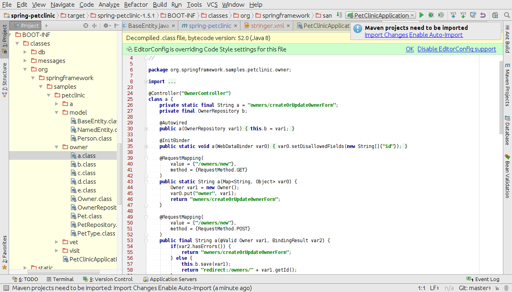

# Spring Boot App Proguard and Stringer Protection
This fork of the sample Spring-based application (https://github.com/spring-projects/spring-petclinic) with Spring Boot is to demonstrate how to Proguard and Stringer both protection for this kind of applications.

Stringer can encrypt strings, protect methods code, etc, but it cannot rename classes, packages, fields, etc. For better protection you can obfuscate application by proguard and then obfuscate it by Stringer.

You can find a good guide about protection Spring apps here: https://midgetontoes.com/tips-for-using-proguard-with-spring-framework

## Proguard obfuscation of a Spring Boot app steps:

1. Add com.github.wvengen.proguard-maven-plugin on the *prepare-package* phase of your app with parameter *injar=classes*. It will run proguard before creating jar and repackaging it. Spring Boot plugin repackages all classes to the BOOT-INF/classes folder withing a jar. Proguard does not work with the repackaged classes correctly.
1. Create a *proguard.conf* in the same project folder like pom.xml
1. Fill the *proguard.conf* like this example
1. If Spring annotations @Service, @Component and @Configuration are used to declare beans, make sure a name is assigned to each bean, e.g. @Component("userHelper") or @Service("userService")
1. Build your app and make sure that your app is working as expected

## Stringer obfuscation of the app

1. Add com.licel.stringer-maven-plugin on the *package* phase of your app
1. Create a file *stringer.xml* like here
1. Add a parameter *proguardMapFile* to the stringer.xml file picking to the map file created by proguard on obfuscation process

## Results

### Not obfuscated app


### Obfuscated by Proguard only app



### Obfuscated by both Proguard and Stringer app


## Running petclinic locally
```
	git clone https://github.com/StringerJavaObfuscator/spring-petclinic
	cd spring-petclinic
	./mvnw spring-boot:run
```

You can then access petclinic here: http://localhost:8080/


## In case you find a bug/suggested improvement for Spring Petclinic
Our issue tracker is available here: https://github.com/spring-projects/spring-petclinic/issues


## Database configuration

In its default configuration, Petclinic uses an in-memory database (HSQLDB) which
gets populated at startup with data. A similar setup is provided for MySql in case a persistent database configuration is needed.
Note that whenever the database type is changed, the data-access.properties file needs to be updated and the mysql-connector-java artifact from the pom.xml needs to be uncommented.

You could start a MySql database with docker:

```
docker run -e MYSQL_ROOT_PASSWORD=petclinic -e MYSQL_DATABASE=petclinic -p 3306:3306 mysql:5.7.8
```

## Working with Petclinic in Eclipse/STS

### prerequisites
The following items should be installed in your system:
* Maven 3 (http://www.sonatype.com/books/mvnref-book/reference/installation.html)
* git command line tool (https://help.github.com/articles/set-up-git)
* Eclipse with the m2e plugin (m2e is installed by default when using the STS (http://www.springsource.org/sts) distribution of Eclipse)

Note: when m2e is available, there is an m2 icon in Help -> About dialog.
If m2e is not there, just follow the install process here: http://eclipse.org/m2e/download/


### Steps:

1) In the command line
```
git clone https://github.com/spring-projects/spring-petclinic.git
```
2) Inside Eclipse
```
File -> Import -> Maven -> Existing Maven project
```


## Looking for something in particular?

|Spring Boot Configuration | Class or Java property files  |
|--------------------------|---|
|The Main Class | [PetClinicApplication](https://github.com/spring-projects/spring-petclinic/blob/master/src/main/java/org/springframework/samples/petclinic/PetClinicApplication.java) |
|Properties Files | [application.properties](https://github.com/spring-projects/spring-petclinic/blob/master/src/main/resources) |
|Caching | [CacheConfig](https://github.com/spring-projects/spring-petclinic/blob/master/src/main/java/org/springframework/samples/petclinic/system/CacheConfig.java) |

## Interesting Spring Petclinic branches and forks

The Spring Petclinic master branch in the main
[spring-projects](https://github.com/spring-projects/spring-petclinic)
GitHub org is the "canonical" implementation, currently based on
Spring Boot and Thymeleaf. There are quite a few forks in a special
GitHub org [spring-petclinic](https://github.com/spring-petclinic). If
you have a special interest in a different technology stack that could
be used to implement the Pet Clinic then please join the community
there.

| Link | Main technologies |
|----------------|-------------------|
| [spring-framework-petclinic](https://github.com/spring-petclinic/spring-framework-petclinic) | Spring Framework XML configuration, JSP pages, 3 persistence layers: JDBC, JPA and Spring Data JPA |
| [javaconfig branch](https://github.com/spring-petclinic/spring-framework-petclinic/tree/javaconfig) | Same frameworks as the [spring-framework-petclinic](https://github.com/spring-petclinic/spring-framework-petclinic) but with Java Configuration instead of XML |
| [spring-petclinic-angular1](https://github.com/spring-petclinic/spring-petclinic-angular1) | AngularJS 1.x, Spring Boot and Spring Data JPA |
| [spring-petclinic-microservices](https://github.com/spring-petclinic/spring-petclinic-microservices) | Distributed version of Spring Petclinic built with Spring Cloud |
| [spring-petclinic-reactjs](https://github.com/spring-petclinic/spring-petclinic-reactjs) | ReactJS (with TypeScript) and Spring Boot |


## Interaction with other open source projects

One of the best parts about working on the Spring Petclinic application is that we have the opportunity to work in direct contact with many Open Source projects. We found some bugs/suggested improvements on various topics such as Spring, Spring Data, Bean Validation and even Eclipse! In many cases, they've been fixed/implemented in just a few days.
Here is a list of them:

| Name | Issue |
|------|-------|
| Spring JDBC: simplify usage of NamedParameterJdbcTemplate | [SPR-10256](https://jira.springsource.org/browse/SPR-10256) and [SPR-10257](https://jira.springsource.org/browse/SPR-10257) |
| Bean Validation / Hibernate Validator: simplify Maven dependencies and backward compatibility |[HV-790](https://hibernate.atlassian.net/browse/HV-790) and [HV-792](https://hibernate.atlassian.net/browse/HV-792) |
| Spring Data: provide more flexibility when working with JPQL queries | [DATAJPA-292](https://jira.springsource.org/browse/DATAJPA-292) |


# Contributing

The [issue tracker](https://github.com/spring-projects/spring-petclinic/issues) is the preferred channel for bug reports, features requests and submitting pull requests.

For pull requests, editor preferences are available in the [editor config](.editorconfig) for easy use in common text editors. Read more and download plugins at <http://editorconfig.org>.


